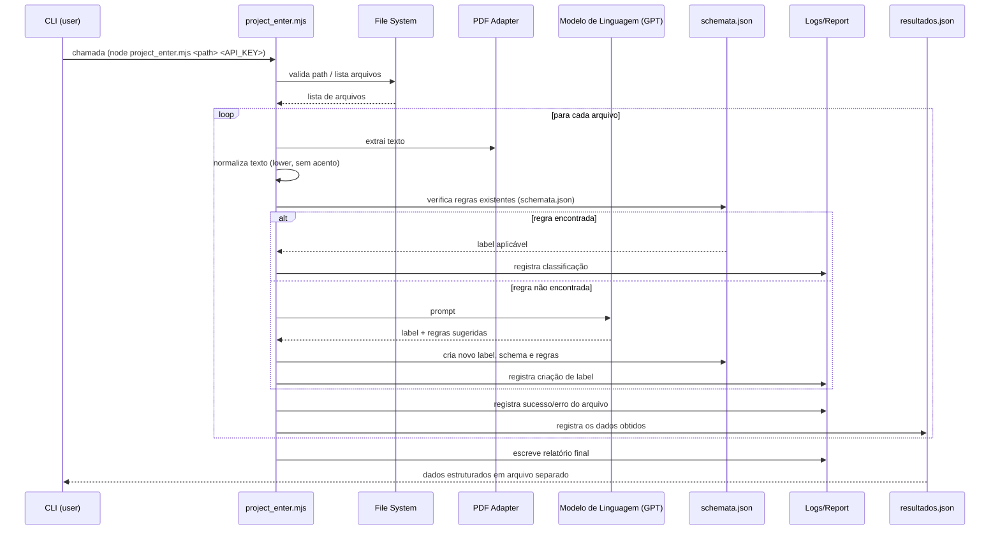

# README.md

Projeto: **PS Talisman — Ferramenta de classificação e extração de documentos**

> Este README descreve os desafios mapeados no projeto, quais foram priorizados, as soluções propostas para cada um, e como executar a solução localmente. No final há um diagrama de sequência (Mermaid) que explica o passo a passo do processamento.

---

## 1. Como rodar

1. **Instale os seguintes pacotes**

```bash
npm install pdf-parse
npm install openai
```

2. **Comando de uso**

```bash
node src/project_enter.mjs ./data/files API_KEY
```
Onde:
- './data/files' é a pasta onde estão os arquivos, é o argumento [2] da chamada
- API_KEY por segurança não foi passada via github, para facilitar a operação colocar como argumento [3]

## 2. Desafios mapeados

1. **Entrada de arquivos e flexibilidade do caminho (path)**

   * Problema: hardcode do path da pasta de arquivos (`const folder = '.\\ai-fellowship-data\\files'`) e necessidade de passar o caminho por terminal.

2. **Leitura confiável de PDFs variados**

   * Problema: PDFs com estruturas diferentes (text layer ausente, metadata nula, extração inconsistente — `parser.extract is not a function`).

3. **Classificação de documentos com poucas regras**

   * Problema: regras baseadas em palavras-chave podem falhar por variações ortográficas (ex.: `endereço` vs `endereco`) e por falta de exemplos.

4. **Geração automática de labels e regras quando não existe label**

   * Problema: criar novas labels e regras com ajuda de um modelo de linguagem, garantindo consistência e rastreabilidade.

5. **Robustez do pipeline (erros silenciosos / crashes)**

   * Problema: quando ocorre erro na extração ou na chamada de geração, o script deve falhar de forma controlada, registrar e seguir processando outros arquivos.

6. **Manutenção do formato das tabelas ao gerar saídas (JSON)**

   * Problema: preservar estrutura original quando realizar cálculos / atualizações (preferência do usuário por não alterar estrutura).

---

## 3. Quais desafios decidimos endereçar (priorizados)

* Prioridade alta: 1 (entrada via terminal), 2 (leitura de PDFs), 4 (geração de labels automáticas), 5 (robustez do pipeline).
* Prioridade média: 3 (variações ortográficas nas regras) — solucionado com normalização + regex tolerante.
* Prioridade baixa: 6 (preservação exata de tabelas JSON) — abordagem documental e sem alterações estruturais automáticas.

---

## 4. Soluções propostas (por desafio)

### 1. Entrada de arquivos via terminal

**Solução:** aceitar o path da pasta como argumento CLI (ex.: `node project_enter.mjs ./meus-arquivos`) e validar se o diretório existe. Fornecer valor padrão quando nenhum argumento for passado.

* Vantagens: flexibilidade, fácil integração em pipelines e testes.
* Implementação: `process.argv` + `fs.existsSync()` + mensagem de ajuda.

---

### 2. Leitura confiável de PDFs

**Solução:** usar um adaptador que tenta múltiplas estratégias por ordem de preferência:

1. Extrair texto via biblioteca principal (`pdf-parse`).
2. Extrair metadados com fallback para `null` mas com logging detalhado.

* Vantagem: aumenta taxa de sucesso com PDFs escaneados e digitais.
* Observação: OCR aumenta custo e tempo; deixá-lo desativado por padrão e ativável via flag `--ocr`.

---

### 3. Robustez do pipeline

**Solução:** adicionar tratamento de erros por arquivo (`try/catch` por arquivo), logging estruturado (arquivo `logs/processing.log`) e um relatório final com estatísticas: total processados / sucesso / falhas.

* Ao ocorrer erro, o pipeline registra o erro, marca o arquivo como `erro` e segue para o próximo.

---

### 4. Geração automática de labels e regras (com LLM)

**Solução:** quando um arquivo for classificado como `Desconhecido`:

1. Construir um prompt que contenha exemplos curtos e o texto extraído.
2. Enviar para o LLM (ex.: GPT) para sugerir uma label e um conjunto de expressões/regra (regex ou keywords).
3. Validar a regra sugerida (executar contra o texto atual e alguns arquivos de teste) antes de persistir.
4. Salvar label + regras em `schemata.json` com metadata (criado_por, data, exemplo_arquivos).

* Observação: registrar versão das regras e possibilidade de revisão manual.

---

### 5. Normalização e tolerância a variação ortográfica

**Solução:** normalizar o texto e as keywords antes de comparar (remover acentos, lower-case, normalização Unicode) e usar correspondência aproximada (fuzzy) quando necessário ou regex que aceite variantes (ex.: `enderec[oO]` ou `inscri(c|ç)ao`).

---

### 6. Preservação de estrutura de tabelas e outputs

**Solução:** ao gerar saídas  escrever JSON de saída com a mesma estrutura de chaves. 

---

## 5. Formato de saída e persistência

* `schemata.json` — array de labels com metadados e regras (não sobrescrever sem revisão manual).
* `resultados.json` - com os dados obtidos organizados de maneira estruturada.
---

## 6. Diagrama de sequência (Mermaid)

Abaixo está um diagrama em Mermaid mostrando o fluxo principal do processamento. Cole este bloco em qualquer renderer que entenda Mermaid (GitHub, VS Code com extensão, etc.).



---

## 7. Debug

* Ao longo do código foram deixadas saídas intermediárias (marcadas no diagrama de seguencia como o participant 'Logs') com 'console.log' comentadas, caso seja necessário manutenção futura.

---

## 8. Próximos passos (work-in-progress)

* Integração com um pequeno painel para revisão manual do schemata sugerido.
* Leitura por LLM do schemata com diversos documentos para revisão dos resultados e possíveis melhorias.

